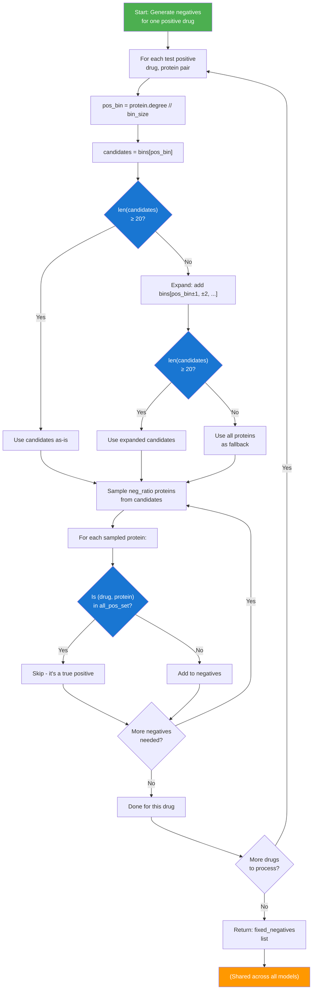

# Degree-Matched Negative Generation - Detailed Explanation

## Overview

**Degree-matched negative sampling** is a method to generate hard negatives that are challenging for the model to distinguish from positives. Instead of sampling negatives uniformly at random, we match the degree (popularity) of negative proteins to the degree of positive proteins.

**Why?** Random negatives can be too easy — pairing a drug with a very unpopular protein is trivial to reject. Degree-matched negatives ensure the model faces realistic, challenging examples.

---

## Problem: Random Negatives Are Too Easy

### Random Sampling (Naive)
```
Positive example:  (Drug_1, Protein_X)
  where Protein_X has degree=50 (appears in 50 training interactions)

Random negative:   (Drug_1, Protein_Y)  
  where Protein_Y has degree=1 (appears in 1 training interaction)

Problem: Model learns to simply reject very unpopular proteins.
This is unrealistic — true negatives (unknown interactions) may be 
with highly connected proteins.
```

### Degree-Matched Sampling (Better)
```
Positive example:  (Drug_1, Protein_X)
  where Protein_X has degree=50

Degree-matched negative: (Drug_1, Protein_Z)
  where Protein_Z has degree=48 (similar to Protein_X's 50)

Benefit: Model must learn semantic difference, not just popularity.
This reflects real-world scenario: unknown interactions may be with 
proteins of similar prominence.
```

---

## How It Works: Step-by-Step

### Step 1: Compute Protein Degrees (from Training Set Only)

```python
def compute_target_degree(train_pairs: List[Tuple[str, str]]) -> Dict[str, int]:
    """Count how many times each protein appears as tail in DTI edges."""
    deg = {}
    for _, p in train_pairs:
        deg[p] = deg.get(p, 0) + 1
    return deg
```

**Example:**
```
Training DRUG_TARGET pairs:
  (DB00001, P12345)  ← P12345 degree += 1
  (DB00002, P12345)  ← P12345 degree += 1
  (DB00001, P67890)  ← P67890 degree += 1
  (DB00003, P11111)  ← P11111 degree += 1
  (DB00004, P67890)  ← P67890 degree += 1

Result:
  p_deg = {
    'P12345': 2,
    'P67890': 2,
    'P11111': 1,
    ...
  }
```

### Step 2: Build Degree Bins

Proteins are grouped into bins by their degree, with bin size 5:

```python
def _build_degree_bins(proteins: List[str], p_deg: Dict[str, int], 
                       bin_size: int = 5) -> Dict[int, List[str]]:
    """Group proteins by degree into bins."""
    bins = {}
    for p in proteins:
        b = p_deg.get(p, 0) // bin_size  # Integer division
        bins.setdefault(b, []).append(p)
    return bins
```

**Example with bin_size=5:**
```
Degrees:         Bin ID:        Bin contents:
  0-4       →      0        →   [P11111, P22222, P33333, ...]  (degree 0-4)
  5-9       →      1        →   [P12345, P67890, P44444, ...]  (degree 5-9)
 10-14      →      2        →   [P55555, P66666, ...]           (degree 10-14)
 15-19      →      3        →   [P77777, P88888, ...]           (degree 15-19)
 ...

Mapping example:
  p_deg['P12345'] = 7  →  bin = 7 // 5 = 1  →  bins[1]
  p_deg['P67890'] = 2  →  bin = 2 // 5 = 0  →  bins[0]
```

---

### Step 3: Generate Negatives Per Drug with Degree Matching

```python
def generate_negatives_per_drug(
    pos_pairs: List[Tuple[str, str]],           # Test positives
    all_pos_set: Set[Tuple[str, str]],          # All positives (train+valid+test)
    proteins_universe: List[str],               # All candidate proteins
    neg_ratio: int,                             # Negatives per positive (e.g., 10)
    rng: np.random.Generator,
    mode: str = "degree_matched",               # "random" or "degree_matched"
    p_deg: Optional[Dict[str, int]] = None,     # Protein degrees (from training)
    bin_size: int = 5,
    max_attempts_factor: int = 200
) -> List[Tuple[str, str]]:
    """
    For each positive (drug, protein) pair in test set:
    1. Find candidate proteins with similar degree to the positive protein
    2. Sample neg_ratio proteins for the SAME drug
    3. Avoid sampling proteins already paired with that drug
    """
```

#### Pseudocode with Explanations:

```python
degree_bins = _build_degree_bins(proteins_universe, p_deg, bin_size=5)
negatives = []

for (drug, pos_protein) in test_positives:
    samples_needed = neg_ratio  # e.g., 10 negatives for this drug
    
    while samples_needed > 0:
        # STEP 3A: Find degree bin of the positive protein
        pos_bin = p_deg.get(pos_protein, 0) // bin_size
        
        # STEP 3B: Start with proteins in same bin
        candidates = degree_bins.get(pos_bin, [])
        
        # STEP 3C: If bin too small (< 20 proteins), expand search
        if len(candidates) < 20:
            candidates = []
            # Add adjacent bins: pos_bin, pos_bin±1, pos_bin±2, ...
            for offset in [0, -1, 1, -2, 2]:
                bin_id = pos_bin + offset
                candidates.extend(degree_bins.get(bin_id, []))
            
            # If still not enough, use all proteins (fallback)
            if len(candidates) < 20:
                candidates = proteins_universe
        
        # STEP 3D: Randomly sample one candidate protein
        neg_protein = random.choice(candidates)
        
        # STEP 3E: Check if (drug, neg_protein) is a true positive
        if (drug, neg_protein) not in all_pos_set:
            # It's a valid negative!
            negatives.append((drug, neg_protein))
            samples_needed -= 1
        # else: Try again (keep looping)

return negatives
```

---

## Concrete Example

### Setup
```
Test positive pairs:
  Pair 1: (DB00001, P12345)  — degree(P12345) = 8
  Pair 2: (DB00002, P67890)  — degree(P67890) = 12
  Pair 3: (DB00003, P11111)  — degree(P11111) = 1

Degree bins (bin_size=5):
  Bin 0: [P11111, P22222]           (degree 0-4)
  Bin 1: [P12345, P33333, P44444]   (degree 5-9)
  Bin 2: [P67890, P55555, P66666]   (degree 10-14)

All known positive pairs (from train+valid+test):
  all_pos_set = {
    (DB00001, P12345), (DB00001, P33333),
    (DB00002, P67890), (DB00002, P55555),
    (DB00003, P11111),
    ...
  }
```

### Generating Negatives for Pair 1: (DB00001, P12345)

**Target:** Generate neg_ratio=2 negatives for drug DB00001

**Iteration 1 (samples_needed=2):**
1. pos_bin = 8 // 5 = 1
2. candidates = bins[1] = [P12345, P33333, P44444]
3. len(candidates) = 3 < 20, so expand:
   - Add bins[0, 2]: [P11111, P22222, P67890, P55555, P66666]
   - candidates = [P12345, P33333, P44444, P11111, P22222, P67890, P55555, P66666]
4. Randomly sample: neg_protein = P44444
5. Check: (DB00001, P44444) not in all_pos_set ✓
6. Add to negatives: (DB00001, P44444)
7. samples_needed = 1

**Iteration 2 (samples_needed=1):**
1. pos_bin = 1
2. candidates expanded as before
3. Randomly sample: neg_protein = P55555
4. Check: (DB00001, P55555) not in all_pos_set ✓
5. Add to negatives: (DB00001, P55555)
6. samples_needed = 0
7. Done for this drug!

**Result:**
```
Fixed negatives for (DB00001, P12345):
  (DB00001, P44444)  — degree(P44444) ≈ 8 (similar to P12345)
  (DB00001, P55555)  — degree(P55555) ≈ 12 (close to P12345)
```

---

## Why "Fixed" Negatives Are Shared Across Models

### The Fairness Problem

```
Scenario: We train 3 models (TransE, ComplEx, TriModel) with same data.
Now we want to evaluate which model best predicts drug-target interactions.

If we generate DIFFERENT negatives for each model:
  Model A: Negatives = {(D1, P1), (D1, P2), (D1, P3)}
  Model B: Negatives = {(D1, P4), (D1, P5), (D1, P6)}
  Model C: Negatives = {(D1, P7), (D1, P8), (D1, P9)}

Problem: They're not being tested on the same problem!
  - Model A might get easier negatives by chance
  - Model B might get harder negatives by chance
  - Comparison is unfair and unreliable
```

### The Solution: Fixed Negatives

```
Generate negatives ONCE, then use the SAME set for all 3 models:
  ALL models: Negatives = {(D1, P1), (D1, P2), ..., (D1, P30)}  ← Same!

Result:
  - All models tested on identical positive/negative splits
  - Fair comparison: differences in AUC/F1 are due to model quality
  - Reproducible: same random seed → same negatives every run
```

### Code Implementation: Generated Before Model Loop

```python
# STEP 1: Generate negatives ONCE (before model loop)
neg_pairs_fixed = generate_negatives_per_drug(
    pos_pairs=test_pos_pairs,
    all_pos_set=all_positive_pairs,
    proteins_universe=proteins_universe,
    neg_ratio=cfg.neg_ratio,  # 10
    rng=np_rng,
    mode=cfg.neg_sampling,    # "degree_matched"
    p_deg=p_deg               # From TRAINING data only
)
print(f"✅ Fixed negatives generated: {len(neg_pairs_fixed)}")  # ~28,940

# STEP 2: Loop over models (9 iterations total)
for model_name in ['TransE', 'ComplEx', 'TriModel']:
    for dim in [100, 200, 300]:
        # Load model checkpoint
        model, entity2id, relation2id = load_model(...)
        
        # Score SAME positive and SAME negative pairs
        pos_scores = score_pairs(model, pos_valid, ...)
        neg_scores = score_pairs(model, neg_pairs_fixed, ...)  # ← REUSED!
        
        # Compute metrics
        metrics = compute_metrics(pos_scores, neg_scores)
```

---

## Degree Matching Visualization

### Degree Distribution

```
Number of proteins
      │
   50 │                    ╱╲
   40 │              ╱╲    ╱  ╲
   30 │        ╱╲    ╱  ╲  ╱    ╲
   20 │   ╱╲  ╱  ╲ ╱    ╲╱      ╲
   10 │  ╱  ╲╱    ╲            ╱ ╲
    0 │_╱____________________╱_____╲___
      0   5   10   15   20   25   30  Protein Degree
      
      Bin 0     Bin 1     Bin 2     Bin 3    Bin 4
    (0-4)      (5-9)    (10-14)   (15-19)  (20-24)
```

### Matching Process

```
Positive protein (P12345) has degree 7 → Bin 1

1. Primary candidates: All proteins in Bin 1
   [P12345, P33333, P44444, ...]  (degree 5-9)

2. If Bin 1 too small, expand to adjacent bins:
   Bin 0 [P11111, P22222, ...]        (degree 0-4)
   Bin 1 [P12345, P33333, ...]        (degree 5-9)
   Bin 2 [P67890, P55555, ...]        (degree 10-14)

3. Sample randomly from combined pool:
   neg_candidates = {P11111, P22222, P12345, P33333, 
                     P44444, P67890, P55555, ...}

4. Select negatives, avoiding true positives:
   Sample → P33333 ✓ (not a known positive)
   Sample → P55555 ✓ (not a known positive)
```

---

## Algorithm Flow Diagram



---

## Configuration Parameters

| Parameter | Default | Meaning |
|-----------|---------|---------|
| `neg_ratio` | 10 | Number of negatives per positive (10:1 ratio) |
| `neg_sampling` | "degree_matched" | Sampling strategy: "random" or "degree_matched" |
| `bin_size` | 5 | Degree bin width (proteins grouped by degree/5) |
| `max_attempts_factor` | 200 | Max attempts = needed_negatives × 200 |
| `seed` | 42 | Random seed for reproducibility |

---

## Benefits & Trade-offs

### Benefits of Degree Matching

| Benefit | Impact |
|---------|--------|
| **Realistic negatives** | Challenges model with hard examples (like real unknowns) |
| **Fairer evaluation** | Avoids trivial rejection of very unpopular proteins |
| **Scientific validity** | Reflects true drug-protein interaction graphs |
| **Reproducible** | Fixed seed → identical negatives across runs |
| **Comparable** | Same negatives for all models → fair comparison |

### Trade-offs

| Issue | Consequence | Mitigation |
|-------|------------|-----------|
| Slow sampling if graph dense | More iterations needed to avoid true positives | `max_attempts_factor` caps attempts |
| May not find enough negatives | Partial negative set generated | Warning printed if < requested |
| Requires TRAINING degrees | Can't use test degrees (leakage) | Computed once from train only |

---

## Code Walkthrough: Main Call

```python
# From main() function in dti_evaluation.py

# Load training pairs to compute degrees
train_pos_pairs = get_dti_pairs(train_df, "DRUG_TARGET")

# Compute target degree from TRAIN only (prevents leakage)
p_deg = compute_target_degree(train_pos_pairs)
print(f"Proteins in training: {len(p_deg)}")  # e.g., 1200

# Get all proteins from all splits (for fair typing)
all_df = pd.concat([train_df, valid_df, test_df], ignore_index=True)
drugs, proteins = get_all_entities_by_type(all_df, "DRUG_TARGET")
print(f"Proteins in all splits: {len(proteins)}")  # e.g., 1242 (36 unseen)

# Get test positives to generate negatives for
test_pos_pairs = get_dti_pairs(test_df, "DRUG_TARGET")
print(f"Test positives: {len(test_pos_pairs)}")  # e.g., 2,894

# Generate fixed negatives (BEFORE model loop!)
neg_pairs_fixed = generate_negatives_per_drug(
    pos_pairs=test_pos_pairs,
    all_pos_set=all_positive_pairs,        # All train+valid+test
    proteins_universe=sorted(list(proteins)),
    neg_ratio=cfg.neg_ratio,               # 10
    rng=np_rng,                            # seeded RNG
    mode=cfg.neg_sampling,                 # "degree_matched"
    p_deg=p_deg,                           # Training degrees only
    bin_size=5
)
print(f"Fixed negatives: {len(neg_pairs_fixed)}")  # ~28,940 (2,894 × 10)

# Now loop over models (all use same negatives)
for model_name in ['TransE', 'ComplEx', 'TriModel']:
    for dim in [100, 200, 300]:
        out = evaluate_one_model(
            model, model_type, model_name,
            test_pos_pairs=test_pos_pairs,
            neg_pairs_fixed=neg_pairs_fixed,  # ← SHARED & FIXED
            entity2id=entity2id,
            relation2id=relation2id,
            cfg=cfg
        )
```

---

## Example Output

```
======================================================================
DTI EVALUATION (FIXED & MULTI-DIMENSION)
======================================================================
Dimensions to evaluate: [100, 200, 300]
neg_ratio=10  neg_sampling=degree_matched  seed=42

Drugs=347 Proteins=1242 (typed from all splits)
All known positives (all splits): 2894
Test positives: 2894
✅ Fixed negatives generated: 28940

======================================================================
EVALUATING MODEL: TransE
======================================================================

  Dimension: 100
    TransE: test positives=2894 valid=2291 dropped=603
    ✅ Results:
       AUC-ROC: 0.8234
       AUC-PR : 0.6789
       Best F1: 0.7012  (thr=0.45)
       Pos/Neg: 2291/22910

  Dimension: 200
    TransE: test positives=2894 valid=2291 dropped=603
    ✅ Results:
       AUC-ROC: 0.8412
       AUC-PR : 0.7011
       Best F1: 0.7215  (thr=0.46)
       Pos/Neg: 2291/22910

  Dimension: 300
    TransE: test positives=2894 valid=2291 dropped=603
    ✅ Results:
       AUC-ROC: 0.8501
       AUC-PR : 0.7134
       Best F1: 0.7301  (thr=0.47)
       Pos/Neg: 2291/22910

  ✅ Saved model master results: ...

======================================================================
EVALUATING MODEL: ComplEx
======================================================================
  ... (same 28,940 negatives used)

======================================================================
EVALUATING MODEL: TriModel
======================================================================
  ... (same 28,940 negatives used)
```

Notice: **Pos/Neg: 2291/22910** is identical across all runs because:
- Same `test_pos_pairs` scored
- Same `neg_pairs_fixed` scored
- Fair comparison guaranteed

---

## Comparison: Random vs Degree-Matched

### Random Negatives
```python
mode = "random"
# For each drug, sample 10 proteins uniformly at random
# Result: Mix of very unpopular (degree 0) to popular (degree 50) proteins
# Problem: Easy classification task
```

### Degree-Matched Negatives
```python
mode = "degree_matched"
# For each drug and each positive protein of degree D:
# Sample negatives from proteins with similar degree (D±2.5 in same bin)
# Result: Hard classification task (semantic difference required)
# Benefit: More realistic evaluation
```

---

## Key Takeaways

1. **Degree matching avoids trivial negatives** — models can't win by just rejecting unpopular proteins

2. **Fixed negatives enable fair comparison** — all models tested on identical problem

3. **Shared across model runs** — one generation phase, then reused 9 times

4. **From training degrees only** — prevents information leakage to test/validation

5. **Graceful fallbacks** — expands bins if needed, uses all proteins as last resort

6. **Reproducible** — seeded RNG ensures same negatives for same seed

