# DTI Evaluation Pipeline - Step-by-Step Flowchart

## Visual Flowchart

```mermaid
flowchart TD
    A([START: DTI Evaluation]) --> B["📂 Load Configuration<br/>- Dims: 100, 200, 300<br/>- Models: TransE, ComplEx, TriModel<br/>- Task: DRUG_TARGET relation"]
    
    B --> C["📥 Load Data Splits<br/>- train.txt<br/>- valid.txt<br/>- test.txt<br/>(TSV: head, relation, tail)"]
    
    C --> D["🏷️ Build Entity Universe<br/>from ALL splits<br/>- Drugs: startswith DB<br/>- Proteins: all DRUG_TARGET tails"]
    
    D --> E["✅ Extract Positive Sets<br/>- all_positive_pairs train+valid+test<br/>- test_pos_pairs from test only"]
    
    E --> F["📊 Compute Target Degree<br/>Count protein occurrences<br/>in TRAIN DRUG_TARGET edges"]
    
    F --> G["🎲 Generate Fixed Negatives ONCE<br/>- For each positive drug<br/>- Sample neg_ratio proteins<br/>- Degree-matched by train degree<br/>- Shared across ALL models"]
    
    G --> H{{"FOR EACH MODEL<br/>TransE<br/>ComplEx<br/>TriModel"}}
    
    H --> I["📂 Create model output dir<br/>outputs_dti_evaluation_fixed/{ModelName}/"]
    
    I --> J{{"FOR EACH DIMENSION<br/>100<br/>200<br/>300"}}
    
    J --> K["📂 Create dim subdirectory<br/>{ModelName}/dim_{dim}/"]
    
    K --> L["🔧 Load Model Checkpoint<br/>- Load {model}_model.pt<br/>- Extract entity2id<br/>- Extract relation2id<br/>- Move to device"]
    
    L --> M["✂️ Filter Test Positives<br/>Keep only pairs where<br/>both drug & protein in entity2id<br/>Track OOV drops"]
    
    M --> N["🎯 Score Positive Pairs<br/>Batch inference on test positives<br/>Using DRUG_TARGET relation<br/>Output: pos_scores"]
    
    N --> O["🎯 Score Negative Pairs<br/>Batch inference on fixed negatives<br/>Using DRUG_TARGET relation<br/>Output: neg_scores"]
    
    O --> P["🔗 Concatenate Scores<br/>y_scores = [pos_scores || neg_scores]<br/>y_true = [1...1 || 0...0]"]
    
    P --> Q["📈 Compute Metrics<br/>- AUC-ROC<br/>- AUC-PR<br/>- Find best F1 threshold<br/>- Precision/Recall @ Best_F1"]
    
    Q --> R["💾 Save Per-Dimension<br/>1. {model}_metrics.csv<br/>2. {model}_scores.npz<br/>3. {model}_evaluation_report.txt<br/>4. figures/ plots"]
    
    R --> J
    
    J -->|All dims done| S["📊 Save Model Master CSV<br/>{model}_metrics_all_dims.csv<br/>9 rows: 3 dims × 3 models"]
    
    S --> H
    
    H -->|All models done| T["🌍 Save Global Master CSV<br/>dti_metrics_all_models_dims.csv<br/>9 rows: 3 models × 3 dims"]
    
    T --> U["📄 Generate Master Report<br/>dti_evaluation_master_report.txt<br/>Summary stats & rankings"]
    
    U --> V([✅ END: Complete])
    
    style A fill:#4CAF50,color:#fff
    style V fill:#4CAF50,color:#fff
    style H fill:#1976D2,color:#fff
    style J fill:#1976D2,color:#fff
    style G fill:#F57C00,color:#fff
    style Q fill:#7B1FA2,color:#fff
```



---

## Phase 1: Data Loading & Setup (Steps A–G)

### A. Load Configuration
- **Input:** Configuration parameters
- **Output:** `cfg: EvalConfig`
- **Details:**
  - `EMBEDDING_DIMS = [100, 200, 300]`
  - `MODELS = {'TransE': 'outputs_transe', 'ComplEx': 'outputs_complex', 'TriModel': 'outputs_trimodel'}`
  - `neg_ratio = 10` (10 negatives per positive)
  - `neg_sampling = "degree_matched"`

### B. Load Data Splits (Optional: valid.txt)
- **Input:** File paths to train.txt, valid.txt, test.txt
- **Output:** Three DataFrames with columns: `[source, relation, target]`
- **Details:**
  - Tab-separated values (TSV)
  - Each row: `drug_id \t relation_name \t protein_id`
  - valid.txt may be empty (graceful handling)

### C. Build Entity Universe
- **Input:** All three DataFrames concatenated
- **Process:**
  1. Extract all drugs: entities starting with "DB" (DrugBank IDs)
  2. Extract all proteins: all tail entities in DRUG_TARGET edges across **all splits**
- **Output:** `drugs: Set[str]`, `proteins: Set[str]`
- **Key Fix:** Typing from all splits prevents underestimating protein universe

### D. Extract Positive Sets
- **Input:** All three DataFrames, relation name "DRUG_TARGET"
- **Process:**
  1. `all_positive_pairs`: Union of DRUG_TARGET edges from train + valid + test (ground truth)
  2. `test_pos_pairs`: DRUG_TARGET edges from test set only (held-out evaluation set)
- **Output:** Two sets of (drug, protein) tuples
- **Rationale:** Prevents false negatives by tracking all known interactions

### E. Compute Target Degree
- **Input:** `train_pos_pairs` (training DRUG_TARGET edges only)
- **Process:** Count how many times each protein appears as tail in training DTI edges
- **Output:** `p_deg: Dict[protein_id → degree]`
- **Purpose:** Enable degree-matched sampling in negatives

### F. Generate Fixed Negatives (Critical!)
- **Input:** 
  - `test_pos_pairs` (positives to generate negatives for)
  - `all_positive_pairs` (to avoid false negatives)
  - `proteins_universe` (candidate proteins)
  - `p_deg` (for degree matching)
- **Process:**
  1. For each positive drug-protein pair in test set:
     - Sample `neg_ratio` (10) proteins for the **same drug**
     - Prefer proteins with similar train-degree to the positive's protein (degree-matched)
     - Avoid proteins already paired with that drug in `all_positive_pairs`
  2. Return fixed list of negative pairs
- **Output:** `neg_pairs_fixed: List[Tuple[str, str]]` (~29K pairs for 10:1 ratio)
- **Why Fixed & Shared?** Ensures fair comparison across all 9 model-dimension runs

---

## Phase 2: Model Loop (Steps H–T)

### H. For Each Model (3 iterations)
Iterate over: `['TransE', 'ComplEx', 'TriModel']`

### I. Create Model Output Directory
```
outputs_dti_evaluation_fixed/
├── TransE/
├── ComplEx/
└── TriModel/
```

### J. For Each Dimension (Nested, 3 iterations)
Iterate over: `[100, 200, 300]`

---

## Phase 3: Per-Dimension Evaluation (Steps K–R)

### K. Create Dimension Subdirectory
```
outputs_dti_evaluation_fixed/TransE/
├── dim_100/
│   ├── figures/
│   ├── transe_metrics.csv
│   ├── transe_scores.npz
│   └── transe_evaluation_report.txt
├── dim_200/
└── dim_300/
```

### L. Load Model Checkpoint
- **Input:** Checkpoint path (e.g., `outputs_transe/dim_100/transe_model.pt`)
- **Process:**
  1. Load PyTorch checkpoint with `torch.load()`
  2. Extract metadata: `num_entities`, `num_relations`, `embedding_dim`
  3. Reconstruct model (TransE, ComplEx, or TriModel)
  4. Load weights into model via `load_state_dict()`
  5. Move to device (CPU/GPU) and set to eval mode
  6. Extract dictionaries: `entity2id` and `relation2id`
- **Output:** `(model, entity2id, relation2id)`

### M. Filter Test Positives to Model Vocabulary
- **Input:** `test_pos_pairs`, `entity2id`
- **Process:**
  1. For each (drug, protein) pair in test positives:
     - Check if drug exists in `entity2id`
     - Check if protein exists in `entity2id`
  2. Keep valid pairs; count dropped pairs
- **Output:** `pos_valid: List[Tuple[str, str]]`, `dropped: int`
- **Why Filter?** KGE models are transductive; unseen entities cannot be scored
- **Example:** If model trained on 2500 drugs but test has 2894, ~394 pairs dropped

### N. Score Positive Pairs
- **Input:** 
  - `pos_valid` (filtered positive pairs)
  - `model` (loaded KGE model)
  - `relation2id` (map "DRUG_TARGET" to numeric relation ID)
  - `entity2id` (map entities to indices)
- **Process:** Batch inference
  1. Convert pair strings to entity IDs: `(drug_id, protein_id)`
  2. Create triples: `(drug_id, DRUG_TARGET_id, protein_id)`
  3. Batch score in batches of 4096 (or configured batch size)
  4. Model computes score (higher = more likely true):
     - **TransE:** $-||h + r - t||_p$ (negative distance)
     - **ComplEx:** $(r_re \cdot h_re \cdot t_re + r_re \cdot h_im \cdot t_im + r_im \cdot h_re \cdot t_im - r_im \cdot h_im \cdot t_re)$
     - **TriModel:** $(h^{v1} \cdot r^{v1} \cdot t^{v1} + h^{v2} \cdot r^{v2} \cdot t^{v2} + h^{v3} \cdot r^{v3} \cdot t^{v3})$
- **Output:** `pos_scores: np.ndarray[float]` (length = ~2K)

### O. Score Negative Pairs
- **Input:** Same as N, but with `neg_pairs_fixed` instead of positive pairs
- **Process:** Identical to N
- **Output:** `neg_scores: np.ndarray[float]` (length = ~30K)

### P. Concatenate Scores
- **Input:** `pos_scores`, `neg_scores`
- **Process:**
  ```python
  y_scores = np.concatenate([pos_scores, neg_scores])
  y_true = np.concatenate([np.ones(len(pos_scores)), 
                           np.zeros(len(neg_scores))])
  ```
- **Output:** `(y_true, y_scores)` — binary classification dataset

### Q. Compute Metrics
- **Input:** `y_true`, `y_scores`
- **Process:** Binary classification evaluation
  1. **AUC-ROC**: `roc_auc_score(y_true, y_scores)` — area under ROC curve
  2. **AUC-PR**: `average_precision_score(y_true, y_scores)` — area under precision-recall curve
  3. **Find Best F1**: Compute F1 scores across all thresholds; pick threshold with max F1
  4. **Precision/Recall @ Best_F1**: Compute via `precision_score()` and `recall_score()` at best threshold
- **Output:** `metrics: Dict` with keys:
  - `AUC-ROC`, `AUC-PR`, `Best_F1`, `Best_Threshold`
  - `Precision@Best_F1`, `Recall@Best_F1`
  - `n_positives`, `n_negatives`, `dropped_test_positives`

### R. Save Per-Dimension Results
Creates 4 outputs per (model, dimension):

1. **CSV Metrics File** (`transe_metrics.csv`)
   ```csv
   Model,Dimension,AUC-ROC,AUC-PR,Best_F1,Best_Threshold,Precision@Best_F1,Recall@Best_F1,n_positives,n_negatives,dropped_test_positives,neg_ratio,neg_sampling,seed
   TransE,100,0.8234,0.6789,0.7012,0.45,0.71,0.69,2291,22910,603,10,degree_matched,42
   ```

2. **Score Arrays NPZ** (`transe_scores.npz`)
   ```
   - y_true: np.ndarray[int] (1 for positive, 0 for negative)
   - y_scores: np.ndarray[float] (model scores)
   ```
   Used for unified comparison plots across models

3. **Evaluation Report** (`transe_evaluation_report.txt`)
   ```
   DTI EVALUATION - TRANSE (Dimension 100)
   ========================================
   Model: TransE
   Embedding dimension: 100
   DTI relation: DRUG_TARGET
   Negative ratio: 10:1
   Negative sampling: degree_matched
   Seed: 42
   
   Results:
     AUC-ROC: 0.8234
     AUC-PR : 0.6789
     Best F1: 0.7012 (thr=0.45)
     Precision/Recall@Best: 0.71/0.69
     Pos/Neg: 2291/22910
     Dropped test positives (OOV): 603
   ```

4. **Visualization Plots** (in `figures/` subdirectory)
   - `roc_curves.png` — ROC curve with AUC-ROC on this model
   - `pr_curves.png` — Precision-recall curve with AP on this model
   - `auc_comparison.png` — Bar chart of AUC-ROC vs AUC-PR

---

## Phase 4: Aggregation (Steps S–U)

### S. Save Model-Level Master CSV
After all 3 dimensions evaluated for one model:
- **File:** `{ModelName}/{model_name}_metrics_all_dims.csv`
- **Content:** 3 rows (one per dimension)
- **Example:** `TransE/transe_metrics_all_dims.csv`

### T. Save Global Master CSV
After all models and dimensions complete:
- **File:** `dti_metrics_all_models_dims.csv`
- **Content:** 9 rows (3 models × 3 dims)
- **Usage:** Unified comparison across all runs

### U. Generate Master Report
- **File:** `dti_evaluation_master_report.txt`
- **Content:**
  - Summary table of all 9 results
  - Detailed breakdown by model
  - Configuration used

---

## Output Directory Structure

```
outputs_dti_evaluation_fixed/
├── dti_metrics_all_models_dims.csv          ← Master CSV (9 rows)
├── dti_evaluation_master_report.txt          ← Master report
│
├── TransE/
│   ├── transe_metrics_all_dims.csv          ← Model CSV (3 rows)
│   ├── transe_evaluation_report.txt         ← Model report
│   ├── dim_100/
│   │   ├── transe_metrics.csv               ← Dimension CSV (1 row)
│   │   ├── transe_scores.npz                ← Raw arrays
│   │   ├── transe_evaluation_report.txt     ← Dimension report
│   │   └── figures/
│   │       ├── roc_curves.png
│   │       ├── pr_curves.png
│   │       └── auc_comparison.png
│   ├── dim_200/  ... (same)
│   └── dim_300/  ... (same)
│
├── ComplEx/
│   ├── complex_metrics_all_dims.csv
│   ├── complex_evaluation_report.txt
│   ├── dim_100/  ...
│   ├── dim_200/  ...
│   └── dim_300/  ...
│
└── TriModel/
    ├── trimodel_metrics_all_dims.csv
    ├── trimodel_evaluation_report.txt
    ├── dim_100/  ...
    ├── dim_200/  ...
    └── dim_300/  ...
```

---

## Key Design Principles

| Principle | Why | Impact |
|-----------|-----|--------|
| **Entity typing from ALL splits** | Prevents underestimating entity universe | Reduces OOV drops; more representative evaluation |
| **Fixed negative set (per-drug sampling)** | Ensures fair comparison across models | Baseline negatives identical for all 9 runs |
| **Degree-matched negatives** | Avoids trivial classification (very easy negatives) | More realistic, challenging evaluation |
| **10:1 negative ratio** | Simulates real-world drug-target sparse graphs | Tests on imbalanced classification |
| **Transductive evaluation** | Reflects real deployment (unseen entities) | OOV drops tracked and reported |
| **Score persistence (NPZ)** | Enables unified comparison plots | All plots use exact same y_true/y_scores |

---

## Metrics Interpretation

| Metric | Range | Formula | Best | Interpretation |
|--------|-------|---------|------|-----------------|
| **AUC-ROC** | [0, 1] | Area under receiver-operating-characteristic curve | 1.0 | Overall ranking quality; robust to class imbalance |
| **AUC-PR** | [0, 1] | Area under precision-recall curve | 1.0 | **PRIMARY for imbalanced data** (many negatives) |
| **Best_F1** | [0, 1] | Max F1 across all thresholds | 1.0 | Balanced recall & precision; good for fixed threshold |
| **Precision@Best_F1** | [0, 1] | $\frac{TP}{TP+FP}$ at best F1 threshold | 1.0 | False positive cost; low if many false alarms |
| **Recall@Best_F1** | [0, 1] | $\frac{TP}{TP+FN}$ at best F1 threshold | 1.0 | False negative cost; discovery focus |

**For DTI:** 
- Use **AUC-PR** as primary metric (imbalanced data)
- Use **F1/Precision** for threshold-based deployment decisions
- Compare **Recall** if discovery of novel interactions is priority

---

## Expected Runtime & Scale

| Aspect | Value |
|--------|-------|
| Models evaluated | 3 (TransE, ComplEx, TriModel) |
| Dimensions per model | 3 (100, 200, 300) |
| Total runs | 9 |
| Test positives (raw) | ~2,894 |
| Test positives (after OOV filter) | ~2,291 (79.1%) |
| Negatives per positive | 10 |
| Total negative pairs | ~22,910 |
| Total triples scored | 9 × (~2,291 + ~22,910) ≈ 226,929 |
| Inference time per model/dim | ~15–30 seconds (CPU) |
| **Total runtime** | ~3–5 minutes (CPU), <1 min (GPU) |

---

## Failure Modes & Robustness

| Failure Mode | Handling |
|--------------|----------|
| Missing checkpoint | Skips that model-dimension combination; continues |
| Relation "DRUG_TARGET" not in model vocab | Returns None; skips evaluation |
| All test positives OOV | Skips evaluation; warns user |
| Cannot generate enough negatives (dense graph) | Generates partial set; warns "requested X, generated Y" |
| Output directory exists | Creates/overwrites gracefully (`os.makedirs(..., exist_ok=True)`) |
| Plot generation error | Continues; warns but doesn't crash |

---

## Example Execution Output

```
======================================================================
DTI EVALUATION (FIXED & MULTI-DIMENSION)
======================================================================
Dimensions to evaluate: [100, 200, 300]
neg_ratio=10  neg_sampling=degree_matched  seed=42

✅ Loaded data from: data/complex
Drugs=347 Proteins=1242 (typed from all splits)
All known positives (all splits): 2894
Test positives: 2894
✅ Fixed negatives generated: 28940

======================================================================
EVALUATING MODEL: TransE
======================================================================

  ------------------------------------------------------------------
  Dimension: 100
  ------------------------------------------------------------------
    Loading TransE (dim=100)...
    TransE: test positives=2894 valid=2291 dropped=603
    ✅ Results:
       AUC-ROC: 0.8234
       AUC-PR : 0.6789
       Best F1: 0.7012  (thr=0.45)
       Pos/Neg: 2291/22910
    ✅ Saved: outputs_dti_evaluation_fixed/TransE/dim_100/transe_metrics.csv
    ✅ Saved: outputs_dti_evaluation_fixed/TransE/dim_100/transe_scores.npz
    ✅ Saved: outputs_dti_evaluation_fixed/TransE/dim_100/figures/roc_curves.png
    ✅ Saved: outputs_dti_evaluation_fixed/TransE/dim_100/transe_evaluation_report.txt
  
  ------------------------------------------------------------------
  Dimension: 200
  ------------------------------------------------------------------
    ... (similar output)

  ✅ Saved model master results: outputs_dti_evaluation_fixed/TransE/transe_metrics_all_dims.csv

... (ComplEx and TriModel output)

======================================================================
AGGREGATED RESULTS (ALL MODELS & DIMENSIONS)
======================================================================

Results by Model and Dimension:
----------------------------------------------------------------------
    Model  Dimension  AUC-ROC  AUC-PR  Best_F1
   TransE          100    0.8234    0.6789    0.7012
   TransE          200    0.8412    0.7011    0.7215
   TransE          300    0.8501    0.7134    0.7301
  ComplEx          100    0.7923    0.6234    0.6821
  ComplEx          200    0.8156    0.6512    0.7001
  ComplEx          300    0.8301    0.6789    0.7145
  TriModel         100    0.8101    0.6456    0.6945
  TriModel         200    0.8289    0.6734    0.7112
  TriModel         300    0.8456    0.6987    0.7289

✅ Saved master results: outputs_dti_evaluation_fixed/dti_metrics_all_models_dims.csv
✅ Saved master report: outputs_dti_evaluation_fixed/dti_evaluation_master_report.txt

======================================================================
✅ DTI EVALUATION COMPLETE
======================================================================
```

